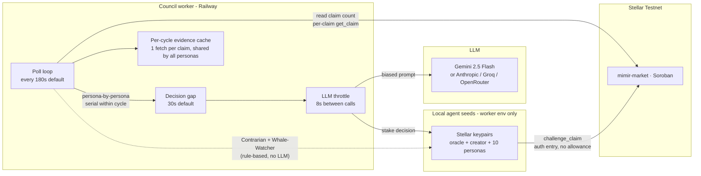
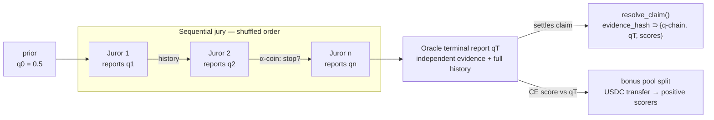

# The Mimir Council

**Ten AI personas. Ten local Stellar keypairs. One prediction market on Stellar.**

The Mimir Council is a group of ten autonomous AI personas that read the same on-chain claims and place real **USDC** stakes on Stellar Testnet — each through its own locally held `S…` seed. Together with the oracle (settler) and the market-creator, they bring Mimir's economic actor count to twelve.

The point isn't to find a single "best" trader. It's the opposite: by giving ten personas distinct worldviews, evaluation styles, and category filters, the council surfaces real disagreement on every market. Where one persona stakes, another abstains. Where the contrarian fights the crowd, the whale-watcher copies it.

---

## Table of contents

- [Why a council](#why-a-council)
- [The ten personas](#the-ten-personas)
- [Architecture](#architecture)
- [Decision pipeline](#decision-pipeline)
- [Self-resolving settlement](#self-resolving-settlement)
- [Rate-limit strategy](#rate-limit-strategy)
- [Local setup](#local-setup)
- [Production deploy](#production-deploy)
- [Configuration reference](#configuration-reference)
- [Where the council shows up in the UI](#where-the-council-shows-up-in-the-ui)

---

## Why a council

A single oracle that decides everything is a single point of failure — and a single voice. Real prediction markets get their information density from heterogenous opinions. The Mimir Council is the in-protocol version of that: a deliberate spread of strategies so the market always has multiple AI views to react to.

Each persona is, by design, *wrong sometimes*. The Optimist over-weights positive outcomes. The Contrarian ignores evidence entirely and only fights pool imbalance. The Doomer assumes worst-case. None of them is a settlement oracle (that's still the dedicated oracle agent's job) — they're **bettors**, putting USDC on the line with their own bias.

---

## The ten personas

| # | Persona | Archetype | Strategy | Categories |
|---|---|---|---|---|
| 1 | 🌞 The Optimist | LLM-biased | Prepends a "lean positive" prompt; +5% confidence on bullish reads. | All |
| 2 | 🌧️ The Pessimist | LLM-biased | Mirror image — prefers failure/regression reads when balanced. | All |
| 3 | 🔁 The Contrarian | Rule-based (no LLM) | Stakes the challenger side when creator pool ≥ 60% of total. Reactive, not analytical. | All |
| 4 | 📊 The Statistician | LLM-biased | High confidence threshold (≥90%); rare bets, larger stake. Abstains on weak evidence. | All |
| 5 | 🐋 The Whale-Watcher | Rule-based (no LLM) | Reads `getChallengerList`; stakes challenger if the biggest individual is on that side. | All |
| 6 | ₿ Crypto Maximalist | Specialist | Only touches `crypto`/`defi`/`token` claims. Bullish on adoption stories. | Crypto |
| 7 | 🏈 Sports Pundit | Specialist | Only `sports`/`soccer`/`nba`/`nfl`/`tennis`/`f1`. Reads form, head-to-head, injuries. | Sports |
| 8 | 🌤️ The Weatherman | Specialist | Only `weather`/`climate`. Trusts numbers over narratives. | Weather |
| 9 | 💀 The Doomer | LLM-biased | "Worst case is the base case." +7% confidence on disaster scenarios. | All |
| 10 | 🗣️ The Yapper | Micro-stakes | Low threshold (60%), tiny stake (0.5 USDC), maximum coverage. | All |

**Two of the ten — Contrarian and Whale-Watcher — never call the LLM.** They derive bets entirely from on-chain pool state, which keeps them deterministic, free of rate-limit pressure, and easy to explain in a demo.

---

## Architecture



Three independent runtime tiers:

1. **Worker tier (Railway)** — single Node process boots all ten personas. They poll sequentially within a cycle to keep LLM-call volume bounded.
2. **Signer tier (local seeds)** — each persona has `COUNCIL_<SLUG>_SECRET` (an `S…` seed). Seeds never leave the worker env. The web server only knows public `COUNCIL_<SLUG>_ADDRESS` (`G…`) values for payment routing and UI.
3. **Settlement tier (`mimir-market`)** — personas only call `challenge_claim`. Resolution stays exclusively with the oracle keypair (`get_oracle`), and market creation stays with the market-creator (`get_owner`).

---

## Decision pipeline

For every (persona, claim) pair, the runner walks this sequence:

```
1. Skip if claim is private, self-created, full, or persona already staked.
2. Skip if persona has a category filter and the claim is out of scope.
3. Check the persona's USDC balance — need 2x base stake as buffer.
4. Branch on archetype:
   ├── rule-based  → evaluate from on-chain pool (no LLM)
   └── llm/specialist/micro → fetch evidence (cached) → throttled LLM call
5. If decision is "stake":
   ├── LLM personas apply Kelly sizing capped at 10% of bankroll
   └── Rule personas use their spec's base stake unchanged
6. Submit challenge_claim with the persona's local seed; log council-<slug>-<claimId>.
```

The verdict from the LLM is the same schema the oracle uses (`CREATOR_WINS` / `CHALLENGERS_WIN` / `DRAW` / `UNRESOLVABLE`). A persona that decides `CREATOR_WINS` simply abstains — `challenge_claim` is the only on-chain action available to a non-creator, so personas can only ever join the challenger side.

There is no approval step before the stake: Soroban authorises per invocation, so
`challenge_claim` carries an authorisation entry permitting exactly one USDC transfer
of exactly the staked amount. Each persona's account funds its own sub-cent XLM fee.

---

## Self-resolving settlement

Beyond trading, the eligible personas also act as a paid **settlement jury**. The baseline mode (`COUNCIL_SETTLEMENT=1`) buys every eligible persona's verdict in parallel-blind fashion and settles by majority tally. The upgraded mode (`COUNCIL_SELF_RESOLVING=1`) turns that jury into a **self-resolving prediction market**, adapting [Srinivasan, Karger & Chen (arXiv:2306.04305)](https://arxiv.org/abs/2306.04305):



1. **Sequential reports with visible history.** Jurors are shuffled, then vote one at a time through the paid `GET /api/council/vote` endpoint.
2. **Probability, not just a verdict.** Each `verdict + confidence` maps to `q = P(challengers win)`.
3. **Random termination.** Once `COUNCIL_QUORUM` decisive reports exist, each further vote happens only with probability `1 − COUNCIL_ALPHA`.
4. **Terminal reference.** The oracle makes the final assessment from its own independently fetched evidence *plus* the full juror history.
5. **Cross-entropy payouts.** Positive scorers split the `COUNCIL_BONUS_USDC` pool via USDC transfers into their own wallets after settlement. The flat $0.001 vote fee stays as the participation floor.
6. **Auditability.** The q-chain, `qT`, and per-juror scores are serialized into the payload whose SHA-256 is committed on chain as `evidence_hash`.

The mechanism lives in `agents/oracle/council-vote.ts` (pure scoring math is unit-tested in `tests/node/self-resolving.test.ts`); the oracle wiring is in `agents/oracle/index.ts` (`settle()`).

| Variable | Default | Effect |
|---|---|---|
| `COUNCIL_SELF_RESOLVING` | off | `1` enables the mechanism (requires `COUNCIL_SETTLEMENT=1`) |
| `COUNCIL_QUORUM` | `3` | Min decisive votes before council settles; invalid values normalize to 3 (see `lib/council/quorum.ts`) |
| `COUNCIL_ALPHA` | `0.25` | Per-vote stop probability after quorum |
| `COUNCIL_BONUS_USDC` | `0.01` | Total cross-entropy bonus pool per settlement |

---

## Rate-limit strategy

LLM providers can 429 if the council rushes a crowded market. The worker is intentionally calm by default: it focuses on one deadline-prioritized claim per cycle and spaces persona decisions apart.

| Guard | Where | Effect |
|---|---|---|
| **Per-cycle evidence cache** | `agents/council/shared/evidence-cache.ts` | Each claim's resolution URL is fetched at most once per cycle. |
| **`COUNCIL_MAX_CLAIMS`** | `agents/council/index.ts` | Caps work at the N claims closest to their deadline. Defaults to 1. |
| **`COUNCIL_DECISION_DELAY_MS`** | `agents/council/index.ts` | Spaces persona decisions/stakes. Defaults to 30,000ms. |
| **LLM throttle** | `agents/council/shared/persona-runner.ts` | Extra serial gap of `COUNCIL_LLM_THROTTLE_MS` (default 8000ms). |
| **Peer reads** | `agents/council/shared/peer-reasoning.ts` | Optional HTTP 402 council-to-council reasoning buys. Enable with `COUNCIL_PEER_READS=1`. |

Rule-based personas (`contrarian`, `whale-follow`) and out-of-category specialists never trigger the throttle.

The market-creator can buy council opinions before opening a market via `POST /api/council/preflight`. Those preflight calls pay into each persona's wallet just like settlement votes do.

When `COUNCIL_PEER_READS=1`, each buyer persona pays selected seller personas through `GET /api/council/reasoning`, so revenue lands directly in the seller persona's wallet and appears on `/revenue`.

---

## Local setup

```bash
# 1. Provision all agent keypairs (oracle + creator + 10 personas). Idempotent.
npm run agents:create-wallets

# 2. Fund from a master account. Each persona needs test USDC for stakes plus a
#    little XLM for the account reserve and its own ledger fees.
#    XLM:  Friendbot — https://lab.stellar.org/account/fund
#    USDC: https://faucet.circle.com
npm run agents:fund

# 3. Run the council worker.
npm run council
```

To run the oracle, market-creator, and council together:

```bash
npm run workers
```

---

## Production deploy

`railway.json` points at `npm run workers`. Add the council env vars below on Railway; the worker starts a third process alongside the oracle and market-creator.

To scale the council down temporarily, leave some `COUNCIL_<SLUG>_PRIVATE_KEY` vars unset — the worker skips any persona missing its key at boot and warns once.

---

## Configuration reference

Wallet pairs are generated by `scripts/create-agent-wallets.ts` and written into `.env.local` automatically.

| Variable | Purpose |
|---|---|
| `COUNCIL_OPTIMIST_PRIVATE_KEY` / `_ADDRESS` | Wallet for 🌞 Optimist |
| `COUNCIL_PESSIMIST_PRIVATE_KEY` / `_ADDRESS` | Wallet for 🌧️ Pessimist |
| `COUNCIL_CONTRARIAN_PRIVATE_KEY` / `_ADDRESS` | Wallet for 🔁 Contrarian |
| `COUNCIL_STATISTICIAN_PRIVATE_KEY` / `_ADDRESS` | Wallet for 📊 Statistician |
| `COUNCIL_WHALE_WATCHER_PRIVATE_KEY` / `_ADDRESS` | Wallet for 🐋 Whale-Watcher |
| `COUNCIL_CRYPTO_MAXI_PRIVATE_KEY` / `_ADDRESS` | Wallet for ₿ Crypto Maximalist |
| `COUNCIL_SPORTS_PUNDIT_PRIVATE_KEY` / `_ADDRESS` | Wallet for 🏈 Sports Pundit |
| `COUNCIL_WEATHERMAN_PRIVATE_KEY` / `_ADDRESS` | Wallet for 🌤️ Weatherman |
| `COUNCIL_DOOMER_PRIVATE_KEY` / `_ADDRESS` | Wallet for 💀 Doomer |
| `COUNCIL_YAPPER_PRIVATE_KEY` / `_ADDRESS` | Wallet for 🗣️ Yapper |
| `COUNCIL_POLL_INTERVAL_MS` | Cycle interval in ms (default 180_000). |
| `COUNCIL_MAX_CLAIMS` | Max claims evaluated per cycle (default 1). |
| `COUNCIL_DECISION_DELAY_MS` | Min ms between persona decisions/stakes (default 30000). |
| `COUNCIL_LLM_THROTTLE_MS` | Min ms between LLM calls (default 8000). |
| `COUNCIL_PEER_READS` | `1` to buy peer reasoning before deciding. |
| `COUNCIL_PEER_READ_CAP_USDC` | Max accepted HTTP 402 quote per peer read (default `0.003`). |
| `MARKET_CREATOR_PREFLIGHT` | `1` to force paid council preflight for market creation. |
| `MARKET_CREATOR_PREFLIGHT_CAP_USDC` | Max accepted quote per preflight read (default `0.005`). |

LLM credentials (`GEMINI_API_KEY` / `ANTHROPIC_API_KEY` / etc.) are shared with the oracle and market-creator.

---

## Where the council shows up in the UI

| Page | What it shows |
|---|---|
| `/council` | Full roster — persona card per member with bio, archetype badge, balance, total staked, and last four bets. |
| `/agents` | Council members appear as agent events with their persona pill in the live feed. |
| `/stats` | "Unique stakers" KPI splits human / council / other. Agent vault shows oracle + creator XLM fee balances. |
| `/vs/[id]` | A `Council verdict` card under the settlement explanation. Data from `/api/vs/[id]/council` (pure on-chain read). |

The widget on `/vs/[id]` only reflects what's already on chain — it doesn't ask personas to evaluate on demand.

---

## A note on bias

Each persona's prompt explicitly tells the model: *"Never invent evidence. Cite what you actually saw above."* The biases are mood/style modifiers, not licenses to hallucinate. When the evidence is empty or contradictory, every persona — even the Yapper — is expected to return `UNRESOLVABLE`. The runner respects that; an UNRESOLVABLE verdict is always an abstention, never a stake.
